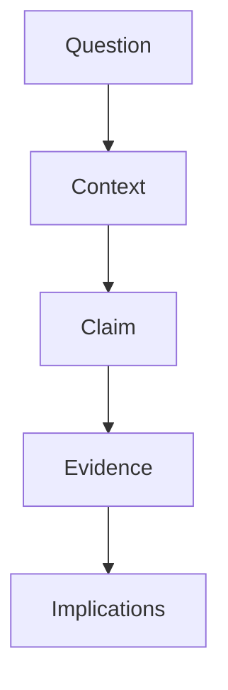
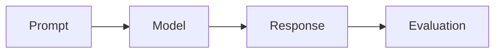

<!-- markdownlint-disable MD033 -->

The Cohere Labs Community Blog is a place for community members to publish research notes, technical essays, experiment reports, and practical perspectives on AI. A good post should help a reader understand a question, a result, or a technique more clearly than they did before.

Use this post as both a writing guide and a feature reference. It shows the default Distill-style post structure, plus examples of the Markdown, Liquid, and Jekyll plugins contributors can use when the content benefits from them.

## What Makes A Good Research Post

Start with the reader's problem. In the first few paragraphs, answer:

- What question are you investigating?
- Why should an AI researcher or builder care?
- What is the key claim or takeaway?
- What evidence, experiment, derivation, or implementation supports it?

Prefer a narrow post with a crisp contribution over a broad survey. A strong post usually has one main idea, enough context to be self-contained, and a clear explanation of what changed your mind.

<!-- prettier-ignore-start -->

> **Tip:** Write the title and description last. They should reflect the final takeaway, not the first idea you started from.
{: .block-tip }

<!-- prettier-ignore-end -->

## Recommended Structure

A research post does not need to follow a paper format, but it should still have a visible argument:



One useful outline is:

1. **Context:** Explain the task, model behavior, dataset, paper, or product setting.
2. **Claim:** State the main observation or recommendation plainly.
3. **Evidence:** Show the experiment, implementation detail, benchmark, examples, or reasoning.
4. **Limits:** Say what the post does not prove.
5. **Next steps:** Point to open questions, replication details, or code.

For copyable TLDR, reproducibility, results table, pseudocode, and code-diff patterns, see [Research Post Patterns]().

## Front Matter

Posts live in `_posts/` and use standard Jekyll front matter. Name files as `YYYY-MM-DD-short-title.md`.

```yaml
---
layout: distill
title: "Your Article Title"
date: YYYY-MM-DD HH:MM:SS
description: A short summary shown on the homepage.
author: Your Name
authors:
  - name: Your Name
    url: https://example.com
    image: authors/your-name.jpg
    bio: One or two sentences about your research interests, community role, or what readers should know about your perspective.
    affiliations:
      name: Cohere Labs Community
tags: ai research evaluation
---
```

Optional front matter enables richer features:

```yaml
toc:
  - name: Main Section
mermaid:
  enabled: true
  zoomable: false
tabs: true
bibliography: my-post.bib
```

The `url`, `image`, and `bio` fields are optional. When at least one author has an `image` or `bio`, the post shows an "About the author" section at the bottom. Author images are stored under `assets/img/`, so `image: authors/your-name.jpg` points to `assets/img/authors/your-name.jpg`.

Only enable features you use. This keeps pages fast.

## Distill Features

Distill posts use `layout: distill`, which gives articles a research-paper style title block, byline, table of contents, citation handling, footnotes, and wide layout helpers.

Use Distill's native footnotes for short asides.<d-footnote>Footnotes are rendered in the appendix and are available inline on hover.</d-footnote> For longer optional context, use a details box:


Details boxes are useful for secondary explanations, extra examples, or setup notes that would interrupt the main argument.


## Sidenotes

Distill supports sidenotes for short context that belongs near the paragraph but should not interrupt the main text. Use them for definitions, caveats, pointers to related work, or small implementation notes.

The most direct syntax is an `<aside>`:

```html
<aside>
  <p>This sidenote appears in the margin on wide screens and falls back into the document flow on small screens.</p>
</aside>
```

Here is a live example. Sidenotes work well when they add useful context without forcing every reader to stop.

<aside>
  <p>This is a sidenote. Keep it brief, because long sidenotes are harder to scan in the margin.</p>
</aside>

## Layout Patterns

The default Distill text column is the best choice for prose, equations, short code snippets, and most figures. It keeps line lengths readable on laptops and desktops.

Use wider layout classes only when the content needs more room:

```html
<div class="l-page">Use this for wide diagrams, tables, or interactive figures.</div>
```

Keep wide elements rare. If a table or code block is wide, make it focused and expect horizontal scrolling on small screens.

## Markdown Basics

Use normal Markdown for most writing:

```markdown
## Section Heading

A paragraph with **bold text**, _emphasis_, `inline code`, and [a link](https://cohere.com/).

- A short bullet
- Another short bullet
```

Tables are useful for compact comparisons:

| Pattern             | Use It For                                        |
| ------------------- | ------------------------------------------------- |
| Short essay         | A clear idea or technical explanation             |
| Experiment report   | A reproducible result with setup and limitations  |
| Implementation note | A practical technique, bug, or engineering lesson |

## Code Blocks

Use fenced code blocks with a language name so syntax highlighting works:

```python
def normalized_margin(chosen_score: float, rejected_score: float) -> float:
    total = abs(chosen_score) + abs(rejected_score)
    if total == 0:
        return 0.0
    return (chosen_score - rejected_score) / total
```

For shell commands, prefer commands readers can run from the repo root:

```bash
docker compose up
```

## Math

Distill posts can use native math tags. Inline math works like <d-math>p(y \mid x)</d-math>, and display math works like this:

<d-math block>
\mathcal{L}(\theta) = -\sum_{i=1}^{n} \log p_{\theta}(y_i \mid x_i)
</d-math>

Use equations to clarify the idea, not to decorate it.

## Diagrams With Mermaid

Set `mermaid.enabled: true` in front matter when a diagram is clearer than prose:

````markdown

````


## Tabs

Set `tabs: true` when you want to compare alternatives without making the page long.





```text
Explain retrieval-augmented generation to a software engineer in three sentences.
```





Check whether the answer defines retrieval, generation, and why grounding helps reduce unsupported claims.





The Liquid syntax is:



```liquid


Content for the first tab.


Content for the second tab.


```



## Figures

Use figures when visual evidence helps the argument. Put images under `assets/img/` and include alt text and a caption.



```liquid

```



## Callouts

Use callouts sparingly for advice, caveats, or risks.

<!-- markdownlint-disable MD028 -->

<!-- prettier-ignore-start -->

> **Warning:** If a result depends on a private dataset, undocumented preprocessing, or a manual filter, say so before presenting the conclusion.
{: .block-warning }

> **Danger:** Do not publish secrets, private data, internal credentials, or unreleased partner information.
{: .block-danger }

<!-- prettier-ignore-end -->

<!-- markdownlint-enable MD028 -->

## Citations And References

For most posts, inline links are enough:

```markdown
This follows the setup from [the original paper](https://example.com/).
```

For citation-heavy Distill posts, add a BibTeX file under `assets/bibliography/`, set it in front matter, and cite keys with Distill's `<d-cite>` tag. Citations render inline and populate the appendix bibliography.



```yaml
bibliography: my-post.bib
```

```html
This is related to prior work <d-cite key="example2026paper"></d-cite>.
```



Here is a live citation example: Tiny Aya is a useful reference when discussing multilingual model scale, depth, and evaluation <d-cite key="salamanca2026tinyayabridgingscale"></d-cite>.

## Heavier Optional Features

The theme still includes support for charts, maps, audio, video, image galleries, notebooks, and other al-folio features. These can be useful, but they add scripts, build time, and review surface. Prefer simple Markdown, code, equations, figures, and Mermaid diagrams unless the richer feature is central to the post.

For chart examples, see [Plot Examples for Research Posts](), which shows Chart.js, Plotly.js, ECharts, and Vega-Lite.

When you do need a heavier feature, document it in front matter and test locally before opening a PR.

## Before Publishing

Before asking for review:

- Confirm the title and description match the actual takeaway.
- Check that every figure has alt text and a useful caption.
- Verify code snippets are minimal and runnable when possible.
- Link to papers, repositories, datasets, or demos that readers need.
- Run the site locally with `docker compose up` and open the post in the browser.

<!-- markdownlint-enable MD033 -->
