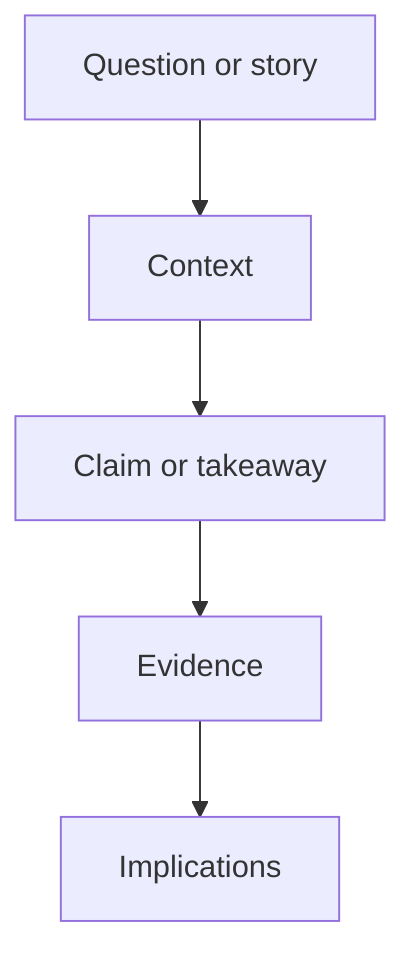
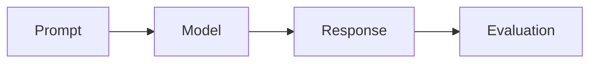

<!-- markdownlint-disable MD033 -->

The Cohere Labs Community Blog is a place for community members to publish research notes, technical essays, experiment reports, project updates, and practical perspectives on AI. A good post should help readers understand a question, result, technique, project, or community story more clearly than they did before.

Use this post as the canonical writing guide and feature reference. It combines contributor workflow, recommended research post structure, copyable content patterns, and examples of the Markdown, Liquid, Distill, and Jekyll features available in this site.

## What To Write

The blog can host several kinds of posts:

- **Deep dives:** Explore recently published work supported by the community, such as Expeditions or collaborative projects.
- **Community spotlights:** Highlight interesting work, people, or projects within the Cohere Labs Community.
- **Project updates and invitations:** Share accessible updates about ongoing projects and invite others to join.
- **Open problems and explorations:** Propose ideas for community members to explore after publication of Cohere Labs-owned projects.
- **Event and program recaps:** Summarize workshops, reading groups, or community initiatives.
- **Stories from the community:** Share a research journey, advice, lessons learned, or personal experience.

First person is welcome when the post is about your experience. Technical details are welcome too, especially when they help readers inspect the work.

## Contributor Workflow

Start by proposing your topic to Madeline or Brittawnya. The early discussion should cover audience, scope, timeline, and whether the piece is a technical deep dive, community story, project update, or another format.

Once aligned, draft the post in a Google Doc and tag Madeline or Brittawnya for feedback. Aim for roughly 500-1,200 words, but prioritize clarity and storytelling over word count. Keep the opening concise: readers should quickly understand the question, story, project, or result and why it matters to the Cohere Labs Community.

Two Cohere Labs team members will review the draft. Revisions focus on clarity, structure, accessibility, and whether the evidence supports the main takeaway. After approval, build the post in Markdown in this repository, then submit it as a pull request.

When the post goes live, the team may share it on social media, announce it in Cohere Labs Discord spaces, and highlight it in the newsletter. Share social handles if you would like to be tagged.

## What Makes A Good Research Post

Start with the reader's problem. In the first few paragraphs, answer:

- What question are you investigating?
- Why should an AI researcher, builder, or community member care?
- What is the key claim, story, or takeaway?
- What evidence, experiment, derivation, implementation, or experience supports it?

Prefer a narrow post with a crisp contribution over a broad survey. A strong post usually has one main idea, enough context to be self-contained, and a clear explanation of what changed your mind.

For research or project posts, include enough detail for readers to inspect the work: datasets, model versions, prompts, metrics, code links, examples, limitations, or open questions. For community stories, balance the narrative with concrete advice, lessons, or context that helps others learn from the experience.

<!-- prettier-ignore-start -->

> **Tip:** Write the title and description last. They should reflect the final takeaway, not the first idea you started from.
{: .block-tip }

<!-- prettier-ignore-end -->

## Recommended Structure

A research post does not need to follow a paper format, but it should still have a visible argument:



One useful outline is:

1. **Context:** Explain the task, model behavior, dataset, paper, program, event, or product setting.
2. **Claim:** State the main observation, recommendation, or lesson plainly.
3. **Evidence:** Show the experiment, implementation detail, benchmark, example, story, or reasoning.
4. **Limits:** Say what the post does not prove.
5. **Next steps:** Point to open questions, replication details, code, project links, or community invitations.

For most posts, a TLDR, a small results table, and a reproducibility box are enough. Add pseudocode, diffs, appendices, or interactive plots only when they clarify the core idea.

## Front Matter

Posts live in `_posts/` and use standard Jekyll front matter. Name files as `YYYY-MM-DD-short-title.md`.

```yaml
---
layout: distill
title: "Your Article Title"
date: YYYY-MM-DD HH:MM:SS
description: "A short summary shown on the homepage."
author: "Your Name"
authors:
  - name: "Your Full Name"
    url: "https://example.com"
    image: "authors/your-name.jpg"
    bio: "One or two sentences about your research interests, community role, or perspective."
    affiliations:
      name: "Cohere Labs Community"
tags: ai research evaluation
toc:
  - name: Introduction
  - name: Main Section
---
```

Keep `author:` even when you add `authors:`. The short `author:` value is useful for previews and listings; the richer `authors:` list powers Distill bylines and author cards.

The `url`, `image`, and `bio` fields are optional. When at least one author has an `image` or `bio`, the post shows an "About the author" section at the bottom. Author images are stored under `assets/img/`, so `image: authors/your-name.jpg` points to `assets/img/authors/your-name.jpg`.

Optional front matter enables richer features:

```yaml
toc:
  - name: Main Section
mermaid:
  enabled: true
  zoomable: false
tabs: true
chart:
  chartjs: true
code_diff: true
pseudocode: true
pretty_table: true
hero:
  type: contour
  motion: hover
  seed: my-post
  intensity: 0.65
  og_image: /assets/img/brand/cohere-labs-community-lockup.svg
bibliography: my-post.bib
```

Only enable features you use. This keeps pages fast and reviews focused.

## Distill Features

Distill posts use `layout: distill`, which gives articles a research-paper style title block, byline, table of contents, citation handling, footnotes, and wide layout helpers.

## Animated Headers

Add an optional `hero:` block when a post benefits from an abstract animated header. The supported types are `contour`, `halftone`, and `waves`. Set `motion: hover` for pointer-reactive movement, `motion: auto` for subtle ambient animation, or `motion: none` for a static generated frame. The `seed` makes the generated art repeatable, and `intensity` accepts a value from `0.1` to `1`.

Always include `og_image` when using an animated header. Social previews cannot run JavaScript, so the image should point to a static SVG or PNG that represents the post well.

Use Distill's native footnotes for short asides.<d-footnote>Footnotes are rendered in the appendix and are available inline on hover.</d-footnote> For longer optional context, use a details box:


Details boxes are useful for secondary explanations, extra examples, prompts, setup notes, or caveats that would interrupt the main argument.


Distill also supports sidenotes for short context that belongs near the paragraph but should not interrupt the main text:

```html
<aside>
  <p>This sidenote appears in the margin on wide screens and falls back into the document flow on small screens.</p>
</aside>
```

Here is a live example. Sidenotes work well when they add useful context without forcing every reader to stop.

<aside>
  <p>This is a sidenote. Keep it brief, because long sidenotes are harder to scan in the margin.</p>
</aside>

## Research Writing Patterns

Use a short opening block when the post is longer than a few paragraphs. It should tell the reader what they will learn before they commit to the details.

```markdown
> **TLDR:** We compare two multilingual evaluation settings and find that prompt translation changes the ranking for low-resource languages.
>
> **Key evidence:** A controlled ablation over four languages, one model family, and two prompt formats.
>
> **Main limitation:** The study uses a small benchmark slice, so treat it as a debugging signal rather than a leaderboard claim.
> {: .block-tip }
```

<!-- prettier-ignore-start -->

> **TLDR:** We compare two multilingual evaluation settings and find that prompt translation changes the ranking for low-resource languages.
>
> **Key evidence:** A controlled ablation over four languages, one model family, and two prompt formats.
>
> **Main limitation:** The study uses a small benchmark slice, so treat it as a debugging signal rather than a leaderboard claim.
{: .block-tip }

<!-- prettier-ignore-end -->

Use a reproducibility box for experiment reports, benchmark notes, dataset writeups, or implementation posts. It should answer what someone would need to rerun or audit the result.



- **Code:** Link to the repository, commit, script, or notebook.
- **Data:** Name the dataset, split, filters, and any private data exclusions.
- **Model:** Name the model checkpoint, version, and decoding settings.
- **Environment:** Include hardware, dependency file, or container if relevant.
- **Evaluation:** Define metrics, prompts, judge model, and aggregation.
- **Limitations:** State what this setup does not test.



Use simple Markdown tables for compact benchmark or ablation summaries. Include units in the header and keep table captions or surrounding text explicit about what changed.

| Setting           | English | Spanish | Arabic | Hindi |
| ----------------- | ------: | ------: | -----: | ----: |
| Baseline prompts  |    68.0 |    54.0 |   49.0 |  46.0 |
| Localized prompts |    70.0 |    61.0 |   58.0 |  55.0 |
| Difference        |    +2.0 |    +7.0 |   +9.0 |  +9.0 |

When a table needs sorting, search, or pagination, set `pretty_table: true` in front matter and use the Bootstrap Table pattern. Otherwise, prefer plain Markdown tables because they are easier to review.

Use pseudocode for algorithms, evaluation loops, reranking procedures, decoding strategies, or data filtering logic. Enable it with `pseudocode: true` in front matter.

```pseudocode
\begin{algorithm}
\caption{Evaluate a prompt variant}
\begin{algorithmic}
\PROCEDURE{EvaluateVariant}{$$D, M, P$$}
    \STATE $$total = 0$$
    \STATE $$count = 0$$
    \FOR{$$i = 1$$ \TO $$|D|$$}
        \STATE $$(x, y) = D[i]$$
        \STATE $$prediction = M(P(x))$$
        \STATE $$total = total + metric(prediction, y)$$
        \STATE $$count = count + 1$$
    \ENDFOR
    \STATE return $$total / count$$
\ENDPROCEDURE
\end{algorithmic}
\end{algorithm}
```

Use code diffs for implementation notes where the change itself is the result. Enable it with `code_diff: true`, use the `diff2html` code block language, and follow the diff with a short explanation of the behavioral impact.

```diff2html
diff --git a/eval.py b/eval.py
index 1111111..2222222 100644
--- a/eval.py
+++ b/eval.py
@@ -8,7 +8,7 @@ def normalize_score(raw_score, num_examples):
     if num_examples == 0:
         return 0.0

-    return raw_score / len(dataset)
+    return raw_score / num_examples
```

## Markdown Basics

Use normal Markdown for most writing:

```markdown
## Section Heading

A paragraph with **bold text**, _emphasis_, `inline code`, and [a link](https://cohere.com/).

- A short bullet
- Another short bullet
```

Tables are useful for compact comparisons:

| Pattern             | Use It For                                        |
| ------------------- | ------------------------------------------------- |
| Short essay         | A clear idea or technical explanation             |
| Experiment report   | A reproducible result with setup and limitations  |
| Implementation note | A practical technique, bug, or engineering lesson |

## Code Blocks

Use fenced code blocks with a language name so syntax highlighting works:

```python
def normalized_margin(chosen_score: float, rejected_score: float) -> float:
    total = abs(chosen_score) + abs(rejected_score)
    if total == 0:
        return 0.0
    return (chosen_score - rejected_score) / total
```

For shell commands, prefer commands readers can run from the repo root:

```bash
docker compose up
```

## Math

Distill posts can use native math tags. Inline math works like <d-math>p(y \mid x)</d-math>, and display math works like this:

<d-math block>
\mathcal{L}(\theta) = -\sum_{i=1}^{n} \log p_{\theta}(y_i \mid x_i)
</d-math>

Use equations to clarify the idea, not to decorate it.

## Diagrams With Mermaid

Set `mermaid.enabled: true` in front matter when a diagram is clearer than prose:

````markdown

````


## Tabs

Set `tabs: true` when you want to compare alternatives without making the page long.





```text
Explain retrieval-augmented generation to a software engineer in three sentences.
```





Check whether the answer defines retrieval, generation, and why grounding helps reduce unsupported claims.





The Liquid syntax is:



```liquid


Content for the first tab.


Content for the second tab.


```



## Figures And Layouts

Use figures when visual evidence helps the argument. Put images under `assets/img/` and include alt text and a caption. Put videos under `assets/video/`.



```liquid

```



The default Distill text column is the best choice for prose, equations, short code snippets, and most figures. Use wider layout classes only when the content needs more room:

```html
<div class="l-page">Use this for wide diagrams, tables, or interactive figures.</div>
```

Keep wide elements rare. If a table or code block is wide, make it focused and expect horizontal scrolling on small screens.

## Plots And Charts

Interactive plots can help when a static table or figure would hide an important comparison. Use them for small, focused views: a metric curve, compact ablation, distribution, or comparison that benefits from tooltips.

Prefer static images for final paper figures, screenshots, or anything that must render identically everywhere. Each chart library adds JavaScript to the page, so only enable the libraries a post actually uses.

Chart libraries are enabled in front matter:

```yaml
chart:
  chartjs: true
  plotly: true
  echarts: true
  vega_lite: true
```

For a normal post, keep only the keys you need.

[Chart.js](https://www.chartjs.org/) is a good fit for simple line, bar, and doughnut charts. Add a fenced `chartjs` block containing a Chart.js JSON config.

```chartjs
{
  "type": "line",
  "data": {
    "labels": ["1B", "3B", "8B", "14B"],
    "datasets": [
      {
        "label": "Average accuracy",
        "data": [42, 51, 58, 62],
        "borderColor": "#b509ac",
        "backgroundColor": "rgba(181, 9, 172, 0.12)",
        "tension": 0.25,
        "fill": true
      }
    ]
  },
  "options": {
    "plugins": {
      "legend": {
        "display": true
      }
    },
    "scales": {
      "y": {
        "beginAtZero": true,
        "title": {
          "display": true,
          "text": "Accuracy"
        }
      }
    }
  }
}
```

[Plotly.js](https://plotly.com/javascript/) is useful for interactive scatter, line, and multi-trace charts. Use a fenced `plotly` block with `data` and optional `layout`.

```plotly
{
  "data": [
    {
      "x": [1, 2, 4, 8, 16],
      "y": [31, 42, 53, 61, 64],
      "mode": "lines+markers",
      "name": "Model A"
    },
    {
      "x": [1, 2, 4, 8, 16],
      "y": [28, 39, 48, 57, 60],
      "mode": "lines+markers",
      "name": "Model B"
    }
  ],
  "layout": {
    "height": 360,
    "margin": {
      "l": 50,
      "r": 20,
      "t": 20,
      "b": 45
    },
    "xaxis": {
      "title": "Training tokens (B)"
    },
    "yaxis": {
      "title": "Accuracy"
    }
  }
}
```

[ECharts](https://echarts.apache.org/) is strong for dashboard-like charts, grouped bars, and polished tooltips. Use a fenced `echarts` block with an ECharts option object.

```echarts
{
  "tooltip": {
    "trigger": "axis"
  },
  "legend": {
    "top": 0
  },
  "grid": {
    "left": 45,
    "right": 20,
    "top": 55,
    "bottom": 35
  },
  "xAxis": {
    "type": "category",
    "data": ["English", "Spanish", "Arabic", "Hindi"]
  },
  "yAxis": {
    "type": "value",
    "name": "Score"
  },
  "series": [
    {
      "name": "Baseline",
      "type": "bar",
      "data": [68, 54, 49, 46]
    },
    {
      "name": "Adapted",
      "type": "bar",
      "data": [70, 61, 58, 55]
    }
  ]
}
```

[Vega-Lite](https://vega.github.io/vega-lite/) is a good choice when you want a declarative grammar of graphics. Use a fenced `vega_lite` block with a Vega-Lite spec.

```vega_lite
{
  "$schema": "https://vega.github.io/schema/vega-lite/v5.json",
  "width": "container",
  "height": 280,
  "data": {
    "values": [
      { "language": "English", "model": "Baseline", "score": 68 },
      { "language": "English", "model": "Adapted", "score": 70 },
      { "language": "Spanish", "model": "Baseline", "score": 54 },
      { "language": "Spanish", "model": "Adapted", "score": 61 },
      { "language": "Arabic", "model": "Baseline", "score": 49 },
      { "language": "Arabic", "model": "Adapted", "score": 58 },
      { "language": "Hindi", "model": "Baseline", "score": 46 },
      { "language": "Hindi", "model": "Adapted", "score": 55 }
    ]
  },
  "mark": "bar",
  "encoding": {
    "x": {
      "field": "language",
      "type": "nominal",
      "axis": {
        "title": null
      }
    },
    "xOffset": {
      "field": "model"
    },
    "y": {
      "field": "score",
      "type": "quantitative",
      "title": "Score"
    },
    "color": {
      "field": "model",
      "type": "nominal"
    },
    "tooltip": [
      { "field": "language", "type": "nominal" },
      { "field": "model", "type": "nominal" },
      { "field": "score", "type": "quantitative" }
    ]
  }
}
```

Use Chart.js for simple charts, Plotly.js for exploratory interactive plots, ECharts for polished dashboard-style visuals, and Vega-Lite when a declarative grammar makes the chart easier to maintain. If the chart is central to the argument, include the data source, axis definitions, and any preprocessing choices in the surrounding text.

## Callouts

Use callouts sparingly for advice, caveats, or risks.

<!-- markdownlint-disable MD028 -->

<!-- prettier-ignore-start -->

> **Warning:** If a result depends on a private dataset, undocumented preprocessing, or a manual filter, say so before presenting the conclusion.
{: .block-warning }

> **Danger:** Do not publish secrets, private data, internal credentials, unreleased partner information, or private community data.
{: .block-danger }

<!-- prettier-ignore-end -->

<!-- markdownlint-enable MD028 -->

## Citations And References

For most posts, inline links are enough:

```markdown
This follows the setup from [the original paper](https://example.com/).
```

For citation-heavy Distill posts, add a BibTeX file under `assets/bibliography/`, set it in front matter, and cite keys with Distill's `<d-cite>` tag. Citations render inline and populate the appendix bibliography.



```yaml
bibliography: my-post.bib
```

```html
This is related to prior work <d-cite key="example2026paper"></d-cite>.
```



The file named in `bibliography:` must exist in `assets/bibliography/`.

Here is a live citation example: Tiny Aya is a useful reference when discussing multilingual model scale, depth, and evaluation <d-cite key="salamanca2026tinyayabridgingscale"></d-cite>.

## Before Publishing

Before asking for review, check that the post has:

- A clear title and one-sentence description.
- A strong opening that states the topic or takeaway.
- Enough context for readers outside the immediate project.
- A result, figure, code snippet, derivation, example, or story that supports the claim.
- Captions or surrounding explanation for images, figures, and plots.
- Plainly stated limitations, caveats, or next steps where relevant.
- Reproducibility details for any experiment or benchmark.
- Links to papers, code, data, model cards, demos, events, or community resources that readers need.

Before requesting review, run:

```bash
npx prettier . --write
docker compose run --rm -e JEKYLL_ENV=production jekyll bundle exec jekyll build
```

For large visual or layout changes, also run the dev server with `docker compose up` and inspect `http://localhost:8080`.

<!-- markdownlint-enable MD033 -->
