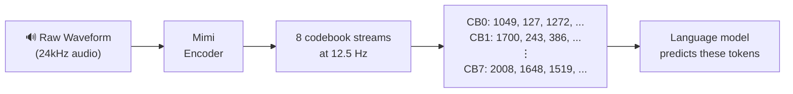
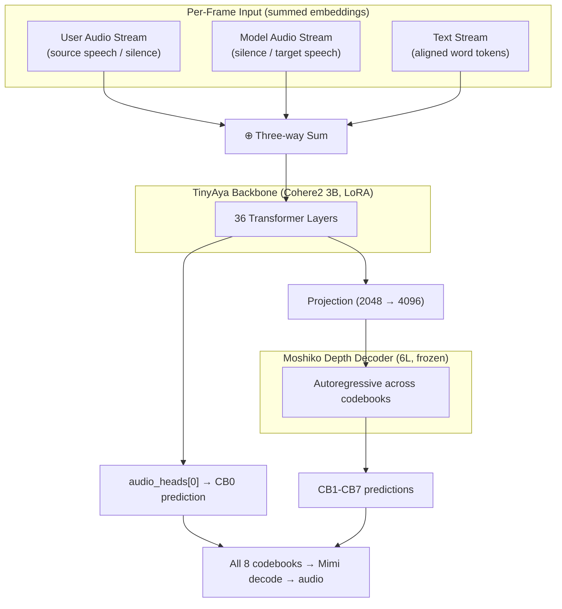

Can a text-only multilingual model learn speech-to-speech translation from scratch, without the massive audio pre-training that most systems rely on? We bet on TinyAya, a 3B Cohere multilingual model that has never processed audio, as the backbone for Turkish↔Hindi simultaneous translation. Here's what we learned.

## Background: How Speech Translation Works Today

Speech-to-speech translation (S2S) is the task of translating spoken language in one language directly into spoken language in another. There are two main approaches:

**The cascade pipeline** breaks translation into three separate stages: Automatic Speech Recognition (ASR) transcribes the source audio to text, Machine Translation (MT) translates the text, and Text-to-Speech (TTS) synthesizes the translated text into audio. This is well understood and widely deployed, but each stage introduces compounding errors. Prosody (rhythm, intonation, emphasis) is lost at the ASR stage and never recovered. Turn-taking in conversation is not preserved. The result often feels robotic and unnatural.

**End-to-end models** skip the text bottleneck and translate directly from audio to audio. Kyutai's [Moshi](https://github.com/kyutai-labs/moshi) <d-cite key="defossez2024moshi"></d-cite> demonstrated that this is possible for real-time dialogue, and their [Hibiki](https://github.com/kyutai-labs/hibiki) <d-cite key="kyutai2024hibiki"></d-cite> model extended the approach to French-English simultaneous translation. Other recent work includes [SakanaAI's Kame](https://pub.sakana.ai/kame/) <d-cite key="sakana2025kame"></d-cite> and [NVIDIA's Personaplex](https://research.nvidia.com/labs/adlr/personaplex/). However, most of these systems rely on massive audio pre-training (Moshi's backbone was trained on 7 million hours of audio) or focus on high-resource language pairs like English-French.

**Our question:** could we build an end-to-end S2S model for a low-resource language pair, without millions of hours of audio pre-training, by leveraging a multilingual text model's existing knowledge? We picked simultaneous translation as our task (difficult enough to be interesting, practical enough to be useful) and chose Turkish and Hindi as our target languages, since most of our team members spoke one or both.

## Choosing the Audio Codec

Before building the translation model, we needed to decide how to represent speech. Neural audio codecs convert raw waveforms into discrete token sequences that language models can process. The choice of codec affects every downstream component.



Each 80ms audio frame becomes 8 integer codes (one per codebook). Codebook 0 (CB0) carries semantic content (what is being said), while CB1 through CB7 encode progressively finer acoustic detail (how it sounds). The model operates entirely on these discrete tokens, with no raw audio processing during training or inference.

The fine-tuned Mimi (full-parameter training, 25 epochs, lr=1e-3 on a [90hr curated dataset](https://huggingface.co/datasets/tiny-aya-translate/hinglish-casual)) showed severe overfitting. MCD (Mel Cepstral Distortion) jumped from ~8.9 to 654 on out-of-distribution data, meaning training artifacts got baked into the reconstruction. DualCodec scored highest on perceptual metrics but had the worst signal fidelity.

We benchmarked three candidates on Hindi speech, testing both in-distribution and out-of-distribution (OOD) data:

| Codec           | OOD STOI  | OOD PESQ-wb | OOD DNSMOS | Verdict                       |
| --------------- | --------- | ----------- | ---------- | ----------------------------- |
| **Base Mimi**   | **0.921** | **3.31**    | 2.87       | Best generalization           |
| Fine-tuned Mimi | 0.825     | 2.27        | 2.76       | Overfitted, degraded          |
| DualCodec       | 0.881     | 2.40        | **2.95**   | Best perceptual, worst signal |

Where **STOI** (Short-Time Objective Intelligibility) measures how well a listener can understand the words, **PESQ-wb** (Perceptual Evaluation of Speech Quality, wideband) rates how natural the audio sounds, and **DNSMOS** (Deep Noise Suppression Mean Opinion Score) is a neural predictor estimating overall audio quality without a reference signal. All are scored higher = better.

**We chose base Mimi (unmodified).** We concluded that the amount of data we had was not enough to make a fine-tuned codec specialize in the audio domains we were targeting. Base Mimi offers 8 codebooks at 12.5 Hz with 24kHz output, dominated the out-of-distribution evaluation (7 out of 13 metric wins), and, critically, it is the codec that [Moshi's](https://github.com/kyutai-labs/moshi) <d-cite key="defossez2024moshi"></d-cite> depth decoder was pretrained on. The pretrained weights expect Mimi's codebook structure, so no adaptation was needed.

## The Bet: Multilingual Text Understanding as a Starting Point for Audio

Moshi's backbone (Helium, 7B) was pre-trained on massive audio before fine-tuning. We replaced it with **[TinyAya](https://huggingface.co/CohereLabs/tiny-aya-base)** <d-cite key="aryabumi2024aya23"></d-cite> (Cohere2, 3.35B), a model that supports 70 languages in text but has never processed a single audio frame. Our primary hypothesis was a text-based multilingual backbone would need less data to learn translation on the audio modality.

This is a fundamentally different bet than Moshi's. They had audio understanding baked in. We are asking the model to learn audio representation, speech translation, and turn-taking all at once, with multilingual text knowledge as the only head start.

## Architecture: Three Streams, Eight Codebooks

The model operates entirely in discrete token space. [Mimi](https://huggingface.co/kyutai/mimi) <d-cite key="kyutai2024mimi"></d-cite> encodes speech into 8 codebook streams at 12.5 Hz, and the model predicts these tokens to generate audio.



**Parallel two-stream format.** Following Moshi, we run two audio streams simultaneously rather than sequentially:

```
Time:          0    1    ...  T_src  T_src+1  ...
User stream:   u0   u1   ...  SIL    SIL      ...
Model stream:  SIL  SIL  ...  m0     m1       ...
Text stream:   src_text...     tgt_text...
```

The user stream carries the source audio, and the model stream carries the target. A silence token (code 2048) means "not speaking." The model learns _when_ to start translating by predicting silence vs. real codes, removing the need for an external Voice Activity Detection (VAD) system.

**Three-way embedding sum.** At each frame, the backbone input is the element-wise sum of three separate embeddings:

- **User audio**: source speech codes, looked up from the backbone's extended embedding table (262,144 text tokens + 4 special + 2,048 audio = 264,196 total). Silence positions are zeroed out.
- **Model audio**: target speech codes, looked up from a dedicated `model_audio_embed` table (2,049 entries, codes 0 through 2047 plus a silence token initialized to zero).
- **Text**: word-level aligned text tokens from a LoRA-adapted (Low-Rank Adaptation <d-cite key="hu2022lora"></d-cite>) embedding, providing what Moshi calls an "inner monologue." This acts as a semantic scaffold that anchors the backbone's hidden states in language meaning, and serves as the bridge that lets TinyAya's pre-existing multilingual knowledge inform the audio generation.

All three information streams merge into a single hidden representation per frame, following Moshi's multimodal fusion approach.

**Hierarchical prediction.** The backbone's 36 transformer layers predict codebook 0 (CB0, semantic content) via a dedicated audio head. A frozen 6-layer depth decoder from Moshiko then predicts CB1 through CB7 (acoustic detail) autoregressively across codebooks within each frame. The backbone handles _what to say_; the depth decoder handles _how it sounds_.

The depth decoder uses Moshi's 8-position layout:

```
Position 0: text (zeroed, backbone hidden state carries this)
Position 1: CB0 input → predicts CB1
Position 2: CB1 input → predicts CB2
...
Position 7: CB6 input → predicts CB7
```

**Codebook delay pattern.** Higher codebooks are temporally staggered: CB1 is shifted right by 1 frame, CB2 by 2, and so on:

```
CB0: [tgt_0, tgt_1, tgt_2, tgt_3, ...]     ← no delay
CB1: [SIL,   tgt_0, tgt_1, tgt_2, ...]     ← 1 step behind
CB2: [SIL,   SIL,   tgt_0, tgt_1, ...]     ← 2 steps behind
```

This gives the depth decoder causal lookahead: when predicting CB2 at frame _t_, it already has CB1 from frame _t+1_. The delay is applied in the dataset and undone after generation before Mimi decoding.

**What's trainable.** We fine-tune approximately 280M parameters out of 4.6B total using LoRA:

| Component                                    | Params | Method                          |
| -------------------------------------------- | ------ | ------------------------------- |
| Backbone LoRA (q_proj, v_proj, embed)        | 7.8M   | LoRA r=16                       |
| Projection (2048→4096)                       | 8.4M   | Full                            |
| Depth decoder I/O layers                     | 97.8M  | Full                            |
| Text embed + audio heads + model_audio_embed | 12.6M  | Full / LoRA                     |
| Depth decoder transformer (6 layers)         | 617M   | **Frozen**                      |
| Backbone transformer (36 layers)             | ~3.1B  | **Frozen** (LoRA adapters only) |

## Data: 911 Hours for $50

No parallel Turkish-Hindi speech corpus exists at scale, so we built one.

**Text collection.** We gathered 56K text pairs from three sources: approximately 2K professional translations from [FLORES](https://huggingface.co/datasets/facebook/flores), around 9K mined pairs from [OPUS-100](https://huggingface.co/datasets/opus100) (pivoted through English), and roughly 45K conversational pairs machine-translated from English datasets (DailyDialog, TopicalChat, PersonaChat) via Cohere's command-r.

**Text-to-Speech generation.** We evaluated four TTS models (XTTSv2, Chatterbox, Fish Speech, OmniVoice) and selected **[OmniVoice](https://github.com/k2-fsa/OmniVoice)** for its cross-lingual reliability. A critical finding: voice _cloning_ failed completely for cross-language synthesis. Turkish reference audio used to generate Hindi output produced garbled speech where source phonetics bled through. Voice _design_ mode (structured text descriptions like `[gender]female[pitch]moderate[accent]Indian`) passed 15 out of 15 quality checks with zero Word Error Rate (WER).

We deployed **42 [Vast.ai](https://vast.ai) GPU instances** running OmniVoice with 14 voice designs across both directions (Turkish to Hindi, Hindi to Turkish). Total cost: approximately $50 in GPU rental for roughly 1.3M audio clips (about 911 hours).

**Quality control.** With around 1.3M generated clips, we needed automated quality control at scale. We built a [round-trip ASR validation pipeline](https://github.com/tiny-aya-simultaneous-translation/sound-quality-check): for each generated audio clip, we transcribed it back to text using [faster-whisper](https://github.com/SYSTRAN/faster-whisper) (large-v3) and compared the transcription against the original text prompt. Clips were accepted if they met these thresholds:

- **WER ≤ 0.20** (Word Error Rate): measures how many words the ASR system got wrong compared to the original text. A WER of 0.20 means at most 20% of words differ, indicating the TTS faithfully reproduced the intended content.
- **Duration between 0.5s and 30s**: filters out silence-only clips and runaway generations.
- **Both source and target audio exist**: ensures complete pairs for bidirectional training.

We deployed 23 Vast.ai instances running faster-whisper for parallel quality control, achieving an **86% pass rate** across validated shards. Failures concentrated in extreme voice designs (for example, `male_old_deep` had the highest rejection rate) and very long sentences.

The full [QC pipeline](https://github.com/tiny-aya-simultaneous-translation/sound-quality-check) also computes DNSMOS (perceptual quality), SNR (Signal-to-Noise Ratio), VAD (Voice Activity Detection) speech ratio, and CER (Character Error Rate). WER is the primary gate, but these additional metrics help catch clips that are technically intelligible but acoustically poor. After filtering, approximately 840K clips (over 900 hours) survived. We then pre-encoded all accepted audio to Mimi tokens with word-level text alignments (from Whisper timestamps or synthetic uniform alignments), producing `.pt` files ready for training. Due to compute constraints, we trained on a quality-filtered 26K-sample subset that demonstrated the architecture's learning trajectory; full-scale training on 840K samples remains future work.


## Training: What Worked and What Didn't

**Loss function.** We train with a weighted sum of text cross-entropy (weight 0.1) and per-codebook audio cross-entropy (weight 1.0), masked to target positions only. An important fix discovered during the project: approximately 62% of text tokens are special padding (between words, end-of-text, silence), and their `lm_head` rows are mean-initialized and effectively unlearnable. Weighting these equally with real tokens pinned the text loss at roughly ln(V) ≈ 12.5 (random). Down-weighting padding to 0.01 unblocked text learning immediately.

**What worked:**

- The Moshi-style composite architecture (backbone predicts CB0, depth decoder predicts CB1 through CB7) trained stably from the first step. Gradient norms stayed well-behaved, and total loss decreased steadily across 5000 steps on 2×H100 GPUs. An overfit test on 20 samples reached 100% teacher-forced accuracy on all 8 codebooks within 300 steps.

<div style="display: grid; grid-template-columns: 1fr 1fr; gap: 1em; margin: 1.5em 0;">
  <div>
    
  </div>
  <div>
    
  </div>
</div>

Here is what the overfit sounds like, comparing ground truth, teacher-forced, and autoregressive generation on a training sample:

<div style="margin: 1em 0;">
<table>
<tr><th>Source (Hindi)</th><th>Ground Truth (Turkish)</th><th>Teacher-Forced</th><th>Autoregressive</th></tr>
<tr>
<td><audio controls src="{{ site.baseurl }}/assets/audio/2026-07-02-adapting-moshi-low-resource-speech-translation/overfit_source.wav" style="width:180px"></audio></td>
<td><audio controls src="{{ site.baseurl }}/assets/audio/2026-07-02-adapting-moshi-low-resource-speech-translation/overfit_target_gt.wav" style="width:180px"></audio></td>
<td><audio controls src="{{ site.baseurl }}/assets/audio/2026-07-02-adapting-moshi-low-resource-speech-translation/overfit_teacher_forced.wav" style="width:180px"></audio></td>
<td><audio controls src="{{ site.baseurl }}/assets/audio/2026-07-02-adapting-moshi-low-resource-speech-translation/overfit_autoregressive.wav" style="width:180px"></audio></td>
</tr>
</table>
<em>Overfit test (20 samples, 300 steps). Teacher-forced closely matches ground truth; autoregressive shows the model can generate coherent speech but with exposure bias artifacts.</em>
</div>

- Text interleaving as an "inner monologue": the text loss acts as a semantic anchor, forcing the backbone's hidden states to maintain linguistic coherence while generating audio. Both audio and text losses dropped well below their random baselines (audio: 6.03 vs 7.62 random; text: 7.20 vs 12.48 random), and validation CB0 accuracy reached 13.4% (vs 0.05% random).

<div style="display: grid; grid-template-columns: 1fr 1fr; gap: 1em; margin: 1.5em 0;">
  <div>
    
  </div>
  <div>
    
  </div>
  <div>
    
  </div>
  <div>
    {% include figure.liquid path="assets/img/2026-07-02-adapting-moshi-low-resource-speech-translation/val-cb0-acc.png" alt="CB0 accuracy increasing from ~7% to ~13%" caption="Validation CB0 accuracy increasing from ~7% to ~13.4%. Random baseline is 0.05% (1/2048), so the model is 260x above chance." %}
  </div>
</div>

- The codebook delay pattern produced smoother audio output than aligned codebooks.
- A W&B hyperparameter sweep (8 Bayesian + hyperband trials) identified `lora_r=64` as the dominant capacity lever and `text_weight=0.2` as the sweet spot between audio quality and semantic grounding.

**What broke (repeatedly):**

- FSDP (Fully Sharded Data Parallel) multi-GPU checkpointing was too buggy. We went through **8 distinct failures** before getting save/load/resume working, ranging from missing `model_audio_embed` in the checkpoint, to FSDP shards being saved instead of full tensors, to `save_pretrained` being called only on rank 0 when it requires all ranks to participate in the allgather. The core lesson: with FSDP, _any_ operation that touches model parameters must involve all ranks.
- The composite's depth decoder position mapping was initially off-by-one. Position 0 (text prediction) was matched against CB0 targets. The training loss looked fine (0.007) but per-codebook accuracy revealed every codebook was misaligned.
- The batch collator silently dropped parallel stream tensors (`user_audio_codes`, `model_audio_codes`), so training fell back to single-stream mode with `model_audio_embed` receiving zero gradients. This was discovered after the first GPU training run completed.

**Our current status**
Although we have validated pipelines and promising initial results, we weren't able to utilize the whole dataset we generated due to compute constraints we encountered during the project. As we continue our scaled training runs, we plan to update our findings and publish the fully trained models if possible.

### Training at Scale: The Full 840K Run

That scaled run is now done. **v0.3 is the full-corpus training run** the pilot deferred: the same Cohere2-LoRA backbone and frozen Moshiko depth decoder, but trained on the entire synthetic corpus rather than a 26K slice. It ran on a single TPU **v6e-16** under a WSD (Warmup-Stable-Decay) learning-rate schedule (a short warmup, a long stable plateau, then an **11,000-step linear anneal to zero**) for **2.07 epochs: 76,250 steps, 2.44M samples, and 6.59B tokens** at a global batch of 32, with **zero preemptions** from start to finish.

At full scale the pilot's open question becomes measurable. The teacher-forced validation signal (logged every 250 steps) shows the two streams learning at very different rates:

- **Text inner-monologue token accuracy climbs from 25.6% to 96.6%**, crossing 90% by roughly step 27,500. The text stream learns the translation mapping, and it learns it early.
- **CB0 (the semantic audio codebook) accuracy rises from 10.4% into the mid-30s within the first 6,000 steps, then crawls to a plateau around 41.5%.** The coarse acoustic token improves fast and then stops; its ceiling is set by the frozen depth decoder, not by how much more data we feed it.
- **Composite validation loss falls monotonically from 6.72 to 2.82** (a 0.4·text + 0.6·audio weighting), across both the plateau and the anneal.

<div style="display: grid; grid-template-columns: 1fr 1fr; gap: 1em; margin: 1.5em 0;">
  <div>
    
  </div>
  <div>
    {% include figure.liquid path="assets/img/2026-07-02-adapting-moshi-low-resource-speech-translation/v0.3-per-codebook-acc.png" alt="v0.3 per-codebook teacher-forced accuracy at step 76,000, every Mimi codebook well above the 0.05% chance floor with a coarse-to-fine falloff" caption="Per-codebook teacher-forced accuracy at step 76,000. Every one of Mimi's eight codebooks sits well above the 0.05% chance floor, in a smooth coarse-to-fine falloff set by the frozen depth decoder. Nothing collapsed." %}
  </div>
</div>

The per-codebook picture is the reassuring part: no stream is dead, every codebook carries information. The open question is how much of that signal survives free-running (autoregressive) generation, not just teacher forcing, which is exactly what the release evals measure.

## What We Learned

**A text-only backbone can learn audio from scratch**, but it is slow. After 5000 steps (roughly 1.5 epochs on 26K samples), the model reliably produces Hindi for Turkish-to-Hindi and Turkish for Hindi-to-Turkish. It learned language identity, but sentence-level translation has not emerged yet. The convergence trajectory suggested that the full 840K dataset with more epochs would change this picture, and the full-corpus v0.3 run confirmed it does, with a clear and consistent shape.

**Capability emerges in a fixed order: language identity, then text translation, then audio synthesis.** This ordering is v0.3's central finding, and the answer to the question the pilot left open.

{% include figure.liquid path="assets/img/2026-07-02-adapting-moshi-low-resource-speech-translation/v0.3-emergence-curve.png" alt="v0.3 emergence curve: teacher-forced text accuracy rising to 96.6% and free-run text chrF++ to about 25 while generated-audio ASR-chrF++ stays near the floor and BLASER-QE holds around 2.5, showing language identity then text translation emerging with audio synthesis lagging" caption="The emergence curve. Over training, teacher-forced text accuracy climbs to 96.6% and free-run text translation reaches chrF++ ~25, while generated-audio ASR-chrF++ stays near the floor and BLASER-2.0 QE holds around 2.5. Capability appears in order: language identity, then text translation, then, still on the frontier, audio synthesis." %}

Language identity comes first (the pilot already saw it at 26K). Text translation follows and grows genuinely strong: the free-run text inner-monologue reaches a chrF++ <d-cite key="popovic2017chrf"></d-cite> of ~25.7 for Hindi-to-Turkish and ~25.1 for Turkish-to-Hindi against machine-translated reference text. Intelligible audio synthesis is the capability that has not yet caught up. The model learns _what_ to say well before it learns _how_ to render it as clean speech.

The static figures above are exported from the run's live dashboard; the free-run end-task points come from the release-eval checkpoint sweep. The **interactive report** below shows the full emergence set — teacher-forced text and cb0 accuracy, the end-task `eval/*` metrics backfilled onto the same training-step axis, the composite loss, and all eight per-codebook accuracies — live on Weights & Biases:

<iframe src="https://wandb.ai/cataluna84/tinyaya-stage2-tpu/reports/TinyAya-v0.3-Emergence-and-Data-Efficiency--VmlldzoxNzU1OTU1NQ==" title="TinyAya v0.3 — live emergence report on Weights & Biases" style="border:1px solid #e1e0d9;border-radius:8px;width:100%;height:920px;margin:1.5em 0" loading="lazy"></iframe>

<div style="text-align:center;margin:-0.5em 0 1.5em"><a href="https://wandb.ai/cataluna84/tinyaya-stage2-tpu/reports/TinyAya-v0.3-Emergence-and-Data-Efficiency--VmlldzoxNzU1OTU1NQ=="><strong>Open the interactive report on Weights &amp; Biases →</strong></a></div>

**The text-backbone bet pays off, and it pays off data-efficiently, in the text stream.** This was the whole premise: that multilingual text pre-training would let the model learn translation with less data than an audio-first system needs. In the inner monologue, it does. Within roughly three epochs the teacher-forced text accuracy reaches 96.6% and free-run text translation reaches chrF++ ~25 in both directions. The head start is real, and it shows up exactly where the text knowledge lives.

**The generated audio carries a real, if weak, translation signal; it is acoustically degraded, not semantically empty.** BLASER-2.0 <d-cite key="seamless2023blaser"></d-cite>, a reference-free score that embeds source and generated _speech_ directly (no ASR transcription in the loop), rates the generated audio at a quality-estimation score of about **2.5 out of 5** in both directions. That is meaningfully higher than the ASR-based metrics suggest, and the gap is informative: BLASER finds source-to-generation similarity that a transcript cannot recover. The translation intent survives into the audio; what degrades is the acoustic rendering.

{% include figure.liquid path="assets/img/2026-07-02-adapting-moshi-low-resource-speech-translation/v0.3-see-it-learn.gif" alt="Animated spectrogram of v0.3 generated target speech across training checkpoints, sharpening from noise toward speech-like structure" caption="See it learn. The generated target-speech spectrogram across training checkpoints: structure sharpens over training, so the audio is acquiring speech-like form even where it is not yet ASR-intelligible, consistent with the weak-but-real BLASER signal." %}

**Intelligible speech synthesis is the remaining frontier, and it is bounded by the frozen depth decoder, not by translation understanding.** Transcribed back to text, the generated audio scores chrF++ 3.7 (Hindi-to-Turkish) and 9.6 (Turkish-to-Hindi), against a ground-truth-audio topline of 92.1 and 86.6, so the codec-and-ASR pipeline ceiling is intact; it is the synthesis that falls short. Perceptual quality sits 1.34 MOS below ground truth (DNSMOS <d-cite key="reddy2021dnsmos"></d-cite> Δ −1.34), and an LLM adequacy judge (GEMBA) rates the transcripts 1.1 out of 5. The bottleneck is the CB0-and-above audio generation, capped by the depth decoder we deliberately kept frozen, not the model's grasp of the translation.

{% include figure.liquid path="assets/img/2026-07-02-adapting-moshi-low-resource-speech-translation/v0.3-eval-vs-topline.png" alt="Bar chart of v0.3 end-task chrF++ versus the ground-truth-audio topline in both directions: generated-audio ASR-chrF++ 3.7 and 9.6 against toplines 92.1 and 86.6, with free-run text chrF++ around 25" caption="End-task chrF++ against the ground-truth-audio topline, both directions. The model translates in text (~25 chrF++), but the generated audio (ASR-chrF++ 3.7 / 9.6) sits far below the intact codec-and-ASR ceiling (92.1 / 86.6). The gap is speech synthesis, not translation." %}

**On real human speech, v0.3 is distribution-bound to its synthetic-TTS acoustics.** We also evaluated on FLEURS, real human recordings re-encoded through Mimi. This is an _acoustic_ domain shift only: the FLEURS texts overlap our training corpus 200 out of 200 (via the shared FLORES slice, audited), so it is not a held-out-text benchmark and we do not treat it as one. Even so, the text stream collapses from ~25 chrF++ in-domain to ~8 on real-speech input, and the topline itself drops to ~61-67. v0.3 has learned to translate the acoustic distribution it was trained on; real microphones are out of that distribution. This is expected for a first full-corpus run on purely synthetic audio, and it is part of the honest picture.

**The Moshi architecture is remarkably modular.** Swapping the backbone, using pretrained depth decoder weights, and adding parallel streams all composed cleanly. The depth decoder's frozen weights "just worked" with our backbone's representations after a learned 2048-to-4096 projection. This has implications for low-resource S2S generally: if the depth decoder transfers across backbones, teams can focus their compute on the temporal backbone and reuse Moshiko's acoustic modeling.

**Data generation is a solved problem at this scale**, at least for language pairs with decent TTS coverage. Synthesizing 911 hours of bilingual speech for $50 with [OmniVoice](https://github.com/k2-fsa/OmniVoice) voice design mode is reproducible and cheap. For language pairs without reliable TTS, the recipe would need adaptation. But for Hindi and Turkish, the bottleneck is compute for training, not data.

**The text stream is load-bearing, not decorative.** One of our runs without working text alignments showed this pretty clearly: text loss flatlined at 12.51 (random), and audio loss plateaued at approximately 6.1 with periodic instability. Our run with text reached an audio loss of 6.03 with text at 7.2. The padding weight fix (62% unlearnable padding tokens drowning real signal) further confirmed it: down-weighting padding to 0.01 unblocked text learning immediately. The "inner monologue" provides essential semantic grounding; get it wrong and audio quality suffers too.

Here is what the broken run looked like, with text loss stuck at random, audio loss plateauing, and total loss stalling:

<div style="display: grid; grid-template-columns: 1fr 1fr 1fr; gap: 1em; margin: 1.5em 0;">
  <div>
    
  </div>
  <div>
    
  </div>
  <div>
    
  </div>
</div>

**Validate the full pipeline before scaling.** We lost multiple training runs to bugs that only surfaced at save/resume/eval time: FSDP checkpoint corruption, collator silently dropping tensors, position mapping off-by-one. An overfit test that checks per-component metrics (not just aggregate loss) and a full save-load-resume-compare pipeline test would have caught these before wasting GPU hours.

## What Comes Next

The pilot closed on a question, _how much training on the full 840K dataset is needed before translation quality emerges, not just language identity?_, and v0.3 answers it. Translation quality **does** emerge, in the text inner-monologue, within about three epochs: teacher-forced text accuracy of 96.6% and free-run text chrF++ around 25 in both directions. What has _not_ emerged at this data and compute budget is intelligible speech synthesis. The frontier moved from "does translation emerge at all" to "how do we render the translation the model has already learned as clean speech."

That reframing points at concrete next levers:

- **Unfreeze or adapt the depth decoder.** The clearest single result of v0.3 is that CB0 accuracy plateaus while the audio topline-to-generation gap is a _synthesis_ gap. The depth decoder we kept frozen from Moshiko is the ceiling; letting it adapt (fully, or with its own adapters) is the most direct lever on audio fidelity.
- **More data and compute.** The text stream is still improving at step 76,250; a larger step budget and more corpus would extend the trajectory we can already see.
- **Real-speech data.** The FLEURS collapse shows v0.3 is bound to synthetic-TTS acoustics. Mixing in real recordings is the way out of that distribution.

To make the emergence itself a reusable artifact, we are releasing the **full ~87-checkpoint suite** from the v0.3 run, not just the final weights, so the data-efficiency curve can be studied checkpoint by checkpoint. The interactive training charts are on [Weights & Biases](https://wandb.ai/cataluna84/tinyaya-stage2-tpu/runs/xzcb60bl), the release model is on [HuggingFace](https://huggingface.co/tiny-aya-translate/tr-hi-s2st-v0.3), and the full end-task evaluation (every number in this section, with method and reproducibility detail) is in the [v0.3 evaluation report](https://github.com/tiny-aya-simultaneous-translation/model/blob/feat/v0.3-implementation/docs/v0.3-eval-report.md).

As before, we are releasing the entire pipeline (code, data, and reports) so others can extend this work to other low-resource language pairs.

## Acknowledgments

This work was done as part of the [Cohere Labs](https://cohere.com/research) Expedition program. I also want to thank our team members, who contributed to this project in the following ways:

- [Alper Balbay](https://www.linkedin.com/in/alperiox/): Overall codec benchmarking, modeling and dataset generation pipelines
- [Mayank Bhaskar](https://www.linkedin.com/in/cataluna84/): Codec benchmarking, TPU-specific training runs and hyperparameter sweeps
- [Dhruv Jain](https://www.linkedin.com/in/dhruv-jain-2b4537229/): Codec benchmarking
- [Ahmet Pamuk](https://www.linkedin.com/in/ahmet-pamuk/): Dataset generation pipeline
- [Omer Yentur](https://www.linkedin.com/in/yentur/): Dataset generation infrastructure
- [Mustafa Yavuz](https://www.linkedin.com/in/mstkyvz/): Dataset generation infrastructure

And, special thanks to [Irem Ergun](https://www.linkedin.com/in/irem-machine-learning-engineer/) for mentoring us throughout the expedition and for shaping both the technical direction and this write-up!

**Compute.** The full-corpus v0.3 training run was made possible by a grant from **[Google's TPU Research Cloud (TRC)](https://sites.research.google/trc/)**, which provided the Cloud **TPU v6e-16** on which the 76,250-step run was trained. We gratefully acknowledge the TRC program's support.

## Resources

The code, data pipeline, model weights, and detailed technical reports are all open:

- [Model training code](https://github.com/tiny-aya-simultaneous-translation/model)
- [Data generation pipeline](https://github.com/tiny-aya-simultaneous-translation/data-pipeline)
- [Model weights on HuggingFace](https://huggingface.co/tiny-aya-translate/tinyaya-stage2-tr-hi-pt)
- [v0.3 full-corpus model weights](https://huggingface.co/tiny-aya-translate/tr-hi-s2st-v0.3)
- [v0.3 evaluation report](https://github.com/tiny-aya-simultaneous-translation/model/blob/feat/v0.3-implementation/docs/v0.3-eval-report.md)
- [v0.3 training run (interactive W&B charts)](https://wandb.ai/cataluna84/tinyaya-stage2-tpu/runs/xzcb60bl)
- [Audio QC pipeline](https://github.com/tiny-aya-simultaneous-translation/sound-quality-check)
- [Technical reports](https://github.com/tiny-aya-simultaneous-translation/tiny-aya-deliverables)
